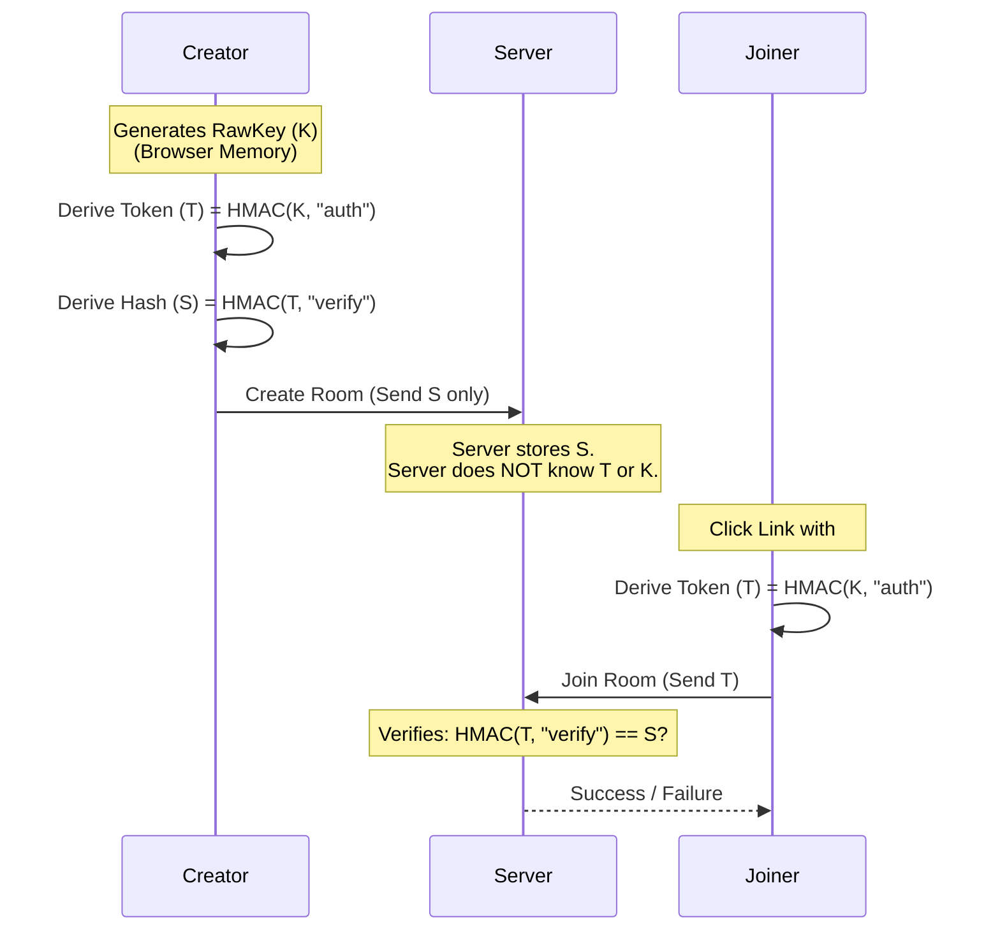
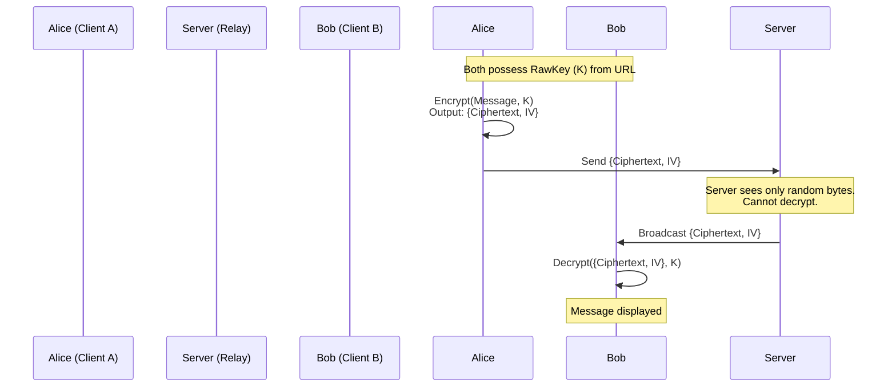

# LetsChat - Secure, Anonymous, Ephemeral.

**LetsChat** is a privacy-first, end-to-end encrypted chat application designed for ephemeral, anonymous communication. It operates on a "Trust No One" architecture where the server acts purely as a blind relay and never has access to message content or decryption keys.

## ✨ Key Features

*   **🔒 End-to-End Encryption:** All messages, usernames, and metadata are encrypted on the client side using **AES-GCM (256-bit)** before they ever touch the network.
*   **🙈 Trust No One (Blind Server):** The server has zero knowledge of the encryption keys. It cannot read messages even if it wanted to.
*   **QP Ephemeral & Anonymous:** No database. No accounts. No login. Messages exist only in RAM and are lost forever once the session ends.
*   **🔗 Secure URL Sharing:**
    *   **Auto-Masking:** Sensitive keys in the URL are immediately removed from the address bar and stored in the browser's History State to prevent shoulder surfing.
    *   **Anti-Leak:** Implements `<meta name="referrer" content="no-referrer">` to prevent leaking keys to third-party sites via links.
*   **⚡ Modern Tech Stack:**
    *   **Frontend:** React (Vite), Tailwind CSS, Web Crypto API.
    *   **Backend:** Node.js, Express, Socket.io.

---

## 🛡️ Security Architecture

### 1. Authentication: The "Lock & Key" Protocol
How does the server allow users to join a room without knowing the room's secret key? We use a **Derived Key** approach.

1.  **Raw Key (K):** Generated on the client. Never leaves the browser.
2.  **Token (T):** Derived from K. Used by clients to prove they have the key.
3.  **Server Hash (S):** Derived from T. Stored by the server to verify T.

Because cryptographic hash functions are one-way, the server can verify `T` matches `S`, but cannot reverse `S` to get `T`, nor reverse `T` to get `K`.



### 2. Encryption: Message Transport
Once authenticated, how are messages exchanged?

1.  **AES-GCM:** We use the Web Crypto API to perform authenticated encryption.
2.  **Payload:** The ciphertext and the Initialization Vector (IV) are sent.
3.  **Forwarding:** The server blindly broadcasts this payload to other sockets in the room.



---

## 🚀 Getting Started

### Prerequisites
*   Node.js (v18 or higher)
*   npm

### 1. Start the Relay Server
The server handles the WebSocket connections.

```bash
cd server
npm install
npm start
# Server runs on http://localhost:3001
```

### 2. Start the Client
The frontend interface.

```bash
cd client
npm install
npm run dev
# Client runs on http://localhost:5173
```

### 3. Usage
1.  Open the Client URL.
2.  Enter the Relay Server URL (default is localhost).
3.  Click **Create Secure Room**.
4.  Copy the secure link (click "Copy Link" at the top).
5.  Send the link to a friend.

---

## 📦 Deployment

### Client (GitHub Pages)
The client is a static SPA and can be hosted anywhere (GitHub Pages, Vercel, Netlify).
This project includes a GitHub Action to deploy to **GitHub Pages** automatically.

1.  Push code to GitHub.
2.  Enable "GitHub Actions" as the source in Repo Settings -> Pages.
3.  The workflow will build and deploy.

### Server
The server must be hosted on a platform that supports Node.js and WebSockets (e.g., Render, Railway, Zeabur, DigitalOcean).

*   **Environment Variables:**
    *   `PORT`: (Optional) Port to run on. Default 3001.

---

## ⚠️ Disclaimer
This project is for educational and privacy-enhancing purposes. While it uses standard cryptographic algorithms (AES-GCM, SHA-256), "perfect" security is a moving target. Use at your own risk.
